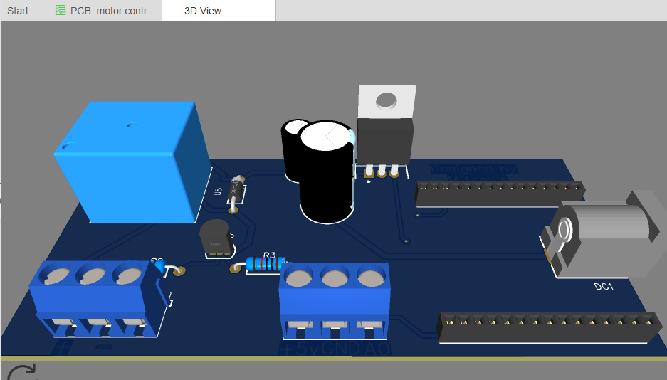
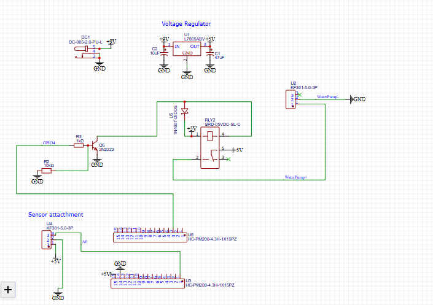

# ESP8266 Water Pump Controller

## Project Overview
A small IoT project to control a water pump via Wi-Fi using an ESP8266. The pump automatically runs for 2 seconds when triggered by an HTTP request.

## Features
- Turn the water pump on for 2 seconds
- Simple JSON response for app integration
- Wi-Fi credentials separated in `config.h` for security

## Setup Instructions
1. Copy `config.example.h` to `config.h` and fill in your Wi-Fi credentials.
2. Open the sketch in Arduino IDE.
3. Upload it to an ESP8266 board.
4. Send MQTT message  plant/pump/on  to trigger the pump.

## Testing
| Test Case | Expected Result | Actual Result | Pass/Fail |
|-----------|----------------|---------------|-----------|
| `/pump/on` request | Pump runs 2 sec | TBD | TBD |
| Rapid requests | Pump triggers correctly each time | TBD | TBD |
| Invalid URL | Pump state unchanged | TBD | TBD |
| Wi-Fi disconnect | Sketch reconnects automatically | TBD | TBD |

## Demo

- `demo.png` is a screenshot of the pump or app in action.
- Clicking the image opens the hosted demo video 

